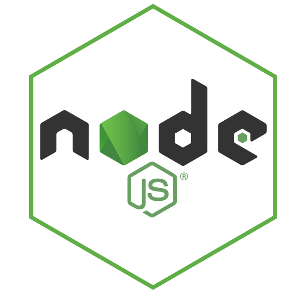

<h1 align="left" id="macropower-title">:wave: Hello there! I'm Nigel Guven</h1>

- :speech_balloon: &nbsp;I am a software engineer with **[LetsGetChecked]**
        
- :seedling: &nbsp;I’m currently following a learning path in **.NET [Development]**
        
- :speech_balloon: &nbsp;I like to talk about **Cars**, **New Technologies** and **History**
        
- :car: My current project car is a **Toyota [GT86]**
        
- :computer: &nbsp;Connect with me on **[LinkedIn]**
   

   

<h2 align="left" id="macropower-tech">My Experience</h2>

<!---###############################################################################-->

> Programming Languages

<table>
<tr>
<td align="center" width="96">

 &nbsp;C#
</td>

<td align="center" width="96">

 Java
</td>

<td align="center" width="96">

 Python
</td>

<td align="center" width="96">

 C++
</td>

</tr>
</table>

<!---###############################################################################-->

> Backend Frameworks

<table>
<tr>

<td align="center" width="96">

 NodeJS
</td>

<td align="center" width="96">

 .NETCore
</td>

<td align="center" width="96">

 Spring Boot
</td>

</tr>
</table>

<!---###############################################################################-->

> Frontend Frameworks

<table>
<tr>

<td align="center" width="96">

 Angular
</td>

<td align="center" width="96">

 Bootstrap
</td>

</tr>
</table>

<!---###############################################################################-->

> Data-Oriented Languages

<table>
<tr>

<td align="center" width="96">

 &nbsp;SQL
</td>

<td align="center" width="96">

 R
</td>

</tr>
</table>

<!---###############################################################################-->

> Scripting Languages

<table>
<tr>

<td align="center" width="96">

 Powershell
</td>

<td align="center" width="96">

 Bash
</td>

</tr>
</table>

<!---###############################################################################-->

> Other Languages

<table>
<tr>

<td align="center" width="96">

 &nbsp;F#
</td>
    
<td align="center" width="96">

 MASM32
</td>

</tr>
</table>

<!---###############################################################################-->

> Data Objects and Serializers

<table>
<tr>

<td align="center" width="96">

 &nbsp;YAML
</td>

<td align="center" width="96">

 XML
</td>
        
<td align="center" width="96">

 JSON
</td>

</tr>
</table>

<!---###############################################################################-->

> .NET Related

<table>
<tr>

<td align="center" width="96">

 Entity Framework
</td>

<td align="center" width="96">

 AutoFixture
</td>

<td align="center" width="96">

 Fluent Validations
</td>
        
<td align="center" width="96">

 Moq
</td>

<td align="center" width="96">

 Stryker
</td>

</tr>
</table>

<!---###############################################################################-->

> Web Styling and Design Flow

<table>
<tr>
        
<td align="center" width="96">

 HTML
</td>

<td align="center" width="96">

 &nbsp;CSS
</td>

<td align="center" width="96">

 SASS
</td>
        
<td align="center" width="96">

 Invision
</td>

<td align="center" width="96">

 Figma
</td>
        
</tr>
</table>
        
<!---###############################################################################-->

> IDE's I use

<table>
<tr>
        
<td align="center" width="96">

 Visual Studio
</td>

<td align="center" width="96">

 Android Studio
</td>

<td align="center" width="96">

 SQL Server
</td>

<td align="center" width="96">

 RStudio
</td>
<td align="center" width="96">

 CodeBlocks
</td>
<td align="center" width="96">

 Eclipse
</td>
        
</tr>
</table>

<!---###############################################################################-->

> Cloud Experience

<table>
<tr>
        
<td align="center" width="96">

 AWS
</td>

<td align="center" width="96">

 Azure
</td>

<td align="center" width="96">

 GCP
</td>
        
</tr>
</table>

<!---###############################################################################-->

> Events, Documentation and Logging

<table>
<tr>
        
<td align="center" width="96">

 Splunk
</td>

<td align="center" width="96">

 Grafana
</td>

<td align="center" width="96">

 Kafka
</td>

<td align="center" width="96">

 Cortex
</td>

<td align="center" width="96">

 Sonarqube
</td>
        
</tr>
</table>

<!---###############################################################################-->

> Dependency Managers

<table>
<tr>
        
<td align="center" width="96">

 Paket
</td>

<td align="center" width="96">

 NuGet
</td>
        
</tr>
</table>

<!---###############################################################################-->

> API Platforms

<table>
<tr>
        
<td align="center" width="96">

 Postman
</td>

<td align="center" width="96">

 SwaggerAPI
</td>
        
</tr>
</table>

<!---###############################################################################-->

> NoSQL Databases I have experience with

<table>
<tr>
        
<td align="center" width="96">

 DynamoDB
</td>

<td align="center" width="96">

 Firebase
</td>
        
</tr>
</table>

<!---###############################################################################-->

> Testing Tools

<table>
<tr>
        
<td align="center" width="96">

 Selenium
</td>

<td align="center" width="96">

 FitNesse
</td>
        
</tr>
</table>

<!---###############################################################################-->

> Systems Analysis

<table>
<tr>
        
<td align="center" width="96">

 UmLet
</td>

<td align="center" width="96">

 Visio
</td>
        
</tr>
</table>

<!---###############################################################################-->

> Infrastructure, VCS, CICD Tools I have implemented in industry

<table>
<tr>
        
<td align="center" width="96">

 Docker
</td>

<td align="center" width="96">

 Terraform
</td>
        
<td align="center" width="96">

 Consul
</td>
        
<td align="center" width="96">

 Jenkins
</td>

<td align="center" width="96">

 Appveyor
</td>

<td align="center" width="96">

 Octopus Deploy
</td>

<td align="center" width="96">

 Helm
</td>
        
<td align="center" width="96">

 Git Distr.
</td>
        
<td align="center" width="96">

 SourceTree
</td>
        
</tr>
</table>

<!---###############################################################################-->

> Agile Frameworks

I have a certificate in Scaled Agile Frameworks 4.0 which I received while on a Graduate Programme at [esw]

<table>
<tr>
        
<td align="center" width="96">

 SAFe 4.0
</td>
        
</tr>
</table>

<!---###############################################################################-->

> Software Architectures I am familiar with

- Vertical Slice Architecture
- Onion N-Tier Architecture
- Event Based Architecture

<!---###############################################################################-->

> .NET Packages I have used in industry

- Dapper
- Mediatr
- Auto-Mapper
- Autofac
- Avro
- Polly
- Nancy
- SpecFlow
- Moq
- Serilog

<!---###############################################################################-->
    
> Interesting cloud features that I have used

:fire: Firebase MLKit

:cloud: Firebase Cloud Functions

:sun_behind_small_cloud: AWS Lambda

:outbox_tray: AWS S3

:pager: AWS SNS

:spiral_notepad: AWS SQS

<!---###############################################################################-->

<!-- links -->

[esw]: https://esw.com/ "eShopWorld"
[linkedin]: https://www.linkedin.com/in/nigel-guven-4728aa159/ "Nigel Guven LinkedIn"
[letsgetchecked]: https://www.letsgetchecked.ie/ "LetsGetChecked IE"
[gt86]: https://www.instagram.com/p/CgrbrP0DvFR/ "Toyota GT86"
[development]: https://i.pinimg.com/564x/f4/fe/d5/f4fed5d7f5b41f56affe501563de94b6.jpg ".Net Developer Path on Pinterest"

