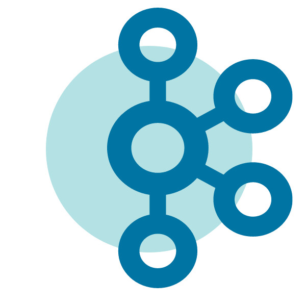
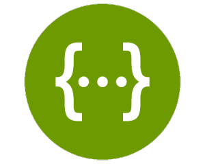
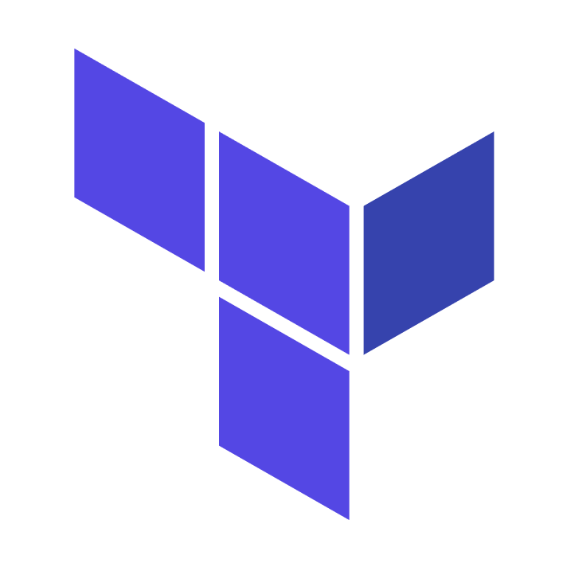

<h1 align="left" id="macropower-title">:wave: Hello there! I'm Nigel Guven</h1>

- :speech_balloon: &nbsp;I am a software engineer with experience at:
  - **[LetsGetChecked](https://www.letsgetchecked.com/)** (July 2021 - Current) | Software Developer 
  - **[EShopWorld](https://esw.com/)** (June 2020 - June 2021) | Junior Software Developer
  - **[Veritas Technologies](https://www.veritas.com/)** (March 2018 - October 2018) | Software Development Intern 

- :seedling: &nbsp;I’m currently following a learning path in **.NET [Development]**  

- :speech_balloon: &nbsp;I like to talk about **Cars**, **New Technologies**, and **History**  

- :car: My current project car is a **Toyota [GT86]**  

- :computer: &nbsp;Connect with me on **[LinkedIn]**  

     

   

<h2 align="left" id="macropower-tech">My Experience</h2>

<!---###############################################################################-->

> Programming Languages

<!---###############################################################################-->

> Backend Frameworks

<!---###############################################################################-->

> Frontend Frameworks

<!---###############################################################################-->

> Scripting Languages

<!---###############################################################################-->

> Data Objects and Serializers

<!---###############################################################################-->

> .NET Related

<!---###############################################################################-->

> Web Styling and Design Flow

        
<!---###############################################################################-->

> IDE's I use

<!---###############################################################################-->

> Cloud Experience

:cloud: 
 

:window: 
 

:fire: :rainbow: 
 

<!---###############################################################################-->

> Events, Documentation and Logging

<table>
<tr>
        
<td align="center" width="96">

 Splunk
</td>

<td align="center" width="96">

 Grafana
</td>

<td align="center" width="96">

 Kafka
</td>

<td align="center" width="96">

 Cortex
</td>

<td align="center" width="96">

 Sonarqube
</td>

<td align="center" width="96">

 Stryker
</td>
        
</tr>
</table>

<!---###############################################################################-->

> Dependency Managers

<table>
<tr>
        
<td align="center" width="96">

 Paket
</td>

<td align="center" width="96">

 NuGet
</td>
        
</tr>
</table>

<!---###############################################################################-->

> API Platforms

<table>
<tr>
        
<td align="center" width="96">

 Postman
</td>

<td align="center" width="96">

 SwaggerAPI
</td>
        
</tr>
</table>

<!---###############################################################################-->

> NoSQL Databases I have experience with

<table>
<tr>
        
<td align="center" width="96">

 DynamoDB
</td>

<td align="center" width="96">

 Firebase
</td>
        
</tr>
</table>

<!---###############################################################################-->

> Testing Tools

<table>
<tr>
        
<td align="center" width="96">

 Selenium
</td>

<td align="center" width="96">

 FitNesse
</td>
        
</tr>
</table>

<!---###############################################################################-->

> Systems Analysis

<table>
<tr>
        
<td align="center" width="96">

 UmLet
</td>

<td align="center" width="96">

 Visio
</td>
        
</tr>
</table>

<!---###############################################################################-->

> Infrastructure, VCS, CICD Tools I have implemented in industry

<table>
<tr>
        
<td align="center" width="96">

 Docker
</td>

<td align="center" width="96">

 Terraform
</td>
        
<td align="center" width="96">

 Consul
</td>
        
<td align="center" width="96">

 Jenkins
</td>

<td align="center" width="96">

 Appveyor
</td>

<td align="center" width="96">

 Octopus Deploy
</td>

<td align="center" width="96">

 Helm
</td>
        
<td align="center" width="96">

 Git Distr.
</td>
        
<td align="center" width="96">

 SourceTree
</td>
        
</tr>
</table>

<!---###############################################################################-->

> Agile Frameworks

I have a certificate in Scaled Agile Frameworks 4.0 which I received while on a Graduate Programme at [esw]

<table>
<tr>
        
<td align="center" width="96">

 SAFe 4.0
</td>
        
</tr>
</table>

<!---###############################################################################-->

> Software Architectures I am familiar with

- Vertical Slice Architecture
- Onion N-Tier Architecture
- Event Based Architecture

<!---###############################################################################-->
    
> Interesting cloud features that I have used

:fire: Firebase MLKit

:cloud: Firebase Cloud Functions

:sun_behind_small_cloud: AWS Lambda

:outbox_tray: AWS S3

:pager: AWS SNS

:spiral_notepad: AWS SQS

<!---###############################################################################-->

<!-- links -->

[esw]: https://esw.com/ "eShopWorld"
[linkedin]: https://www.linkedin.com/in/nigel-guven-4728aa159/ "Nigel Guven LinkedIn"
[letsgetchecked]: https://www.letsgetchecked.ie/ "LetsGetChecked IE"
[gt86]: https://www.instagram.com/p/CgrbrP0DvFR/ "Toyota GT86"
[development]: https://i.pinimg.com/564x/f4/fe/d5/f4fed5d7f5b41f56affe501563de94b6.jpg ".Net Developer Path on Pinterest"

